#### Alguns componentes do android feitos com o KivyMD

Time Picker
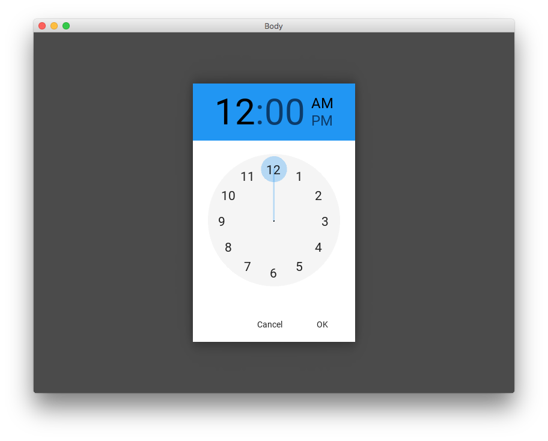

Popup
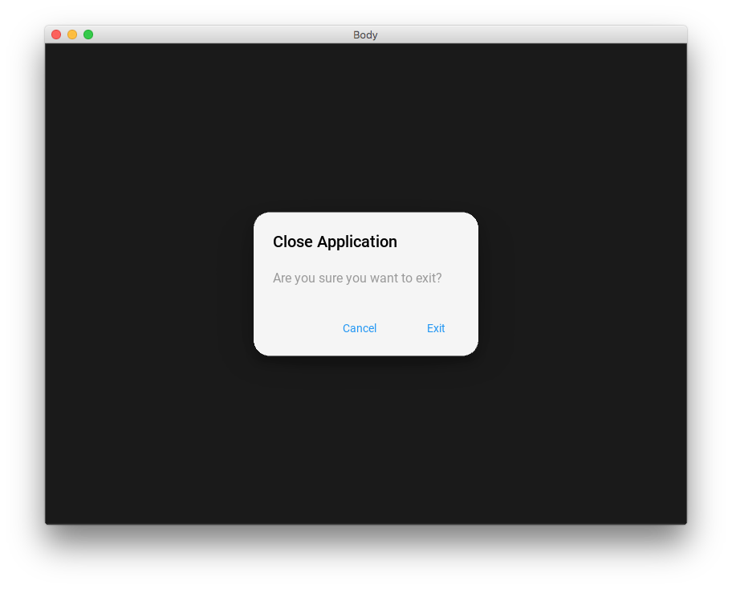

Appbar
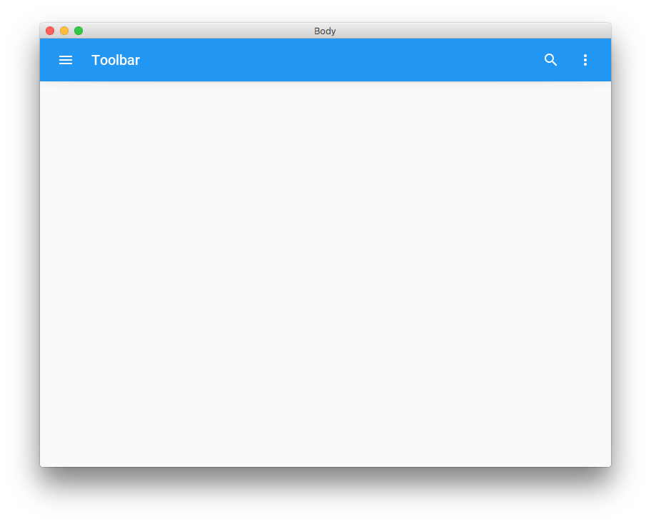

Buttons
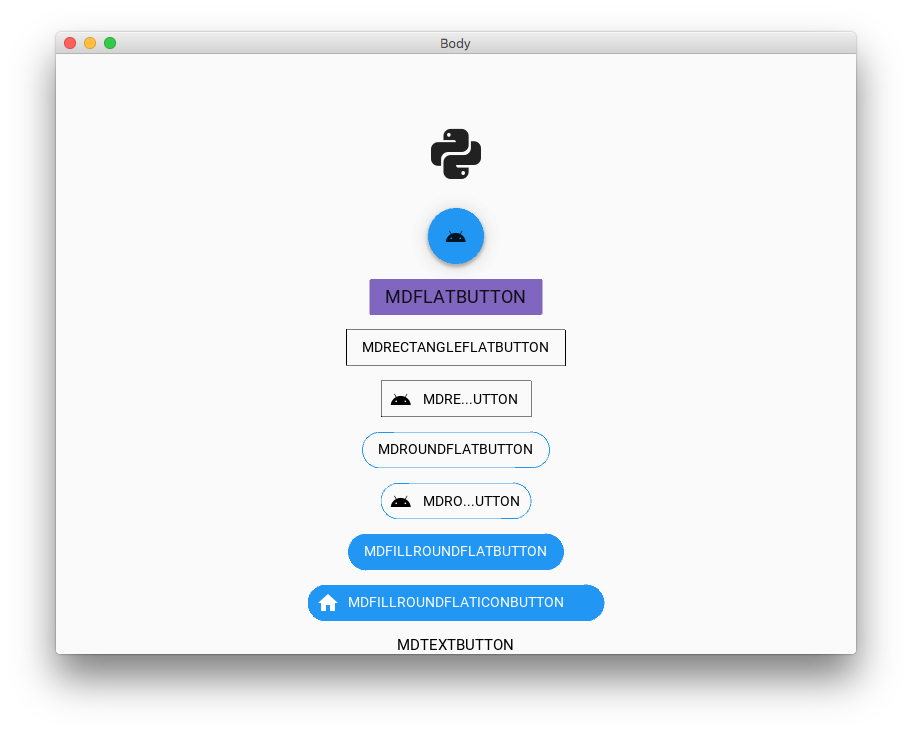

Textfield
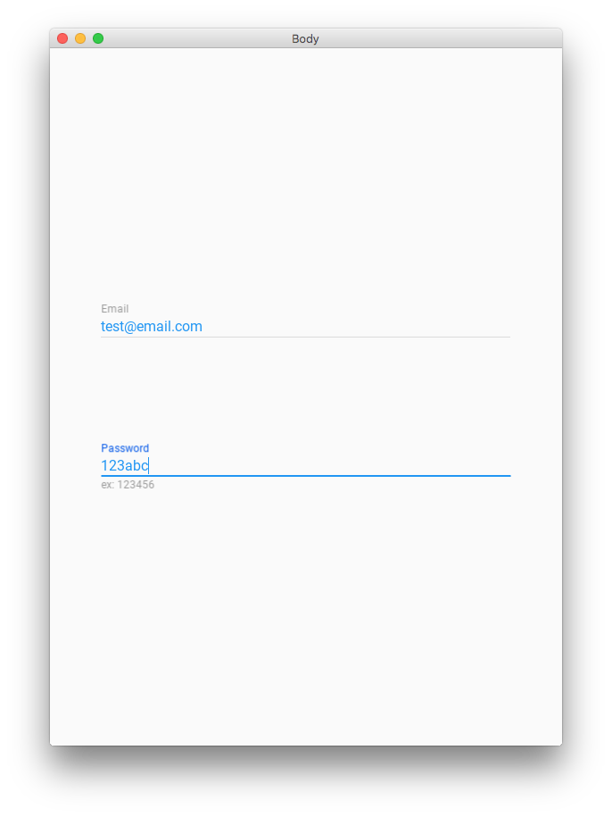

Toast
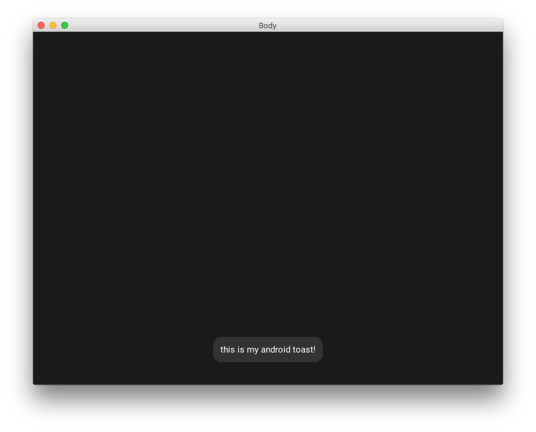

Bottom Navigation Bar
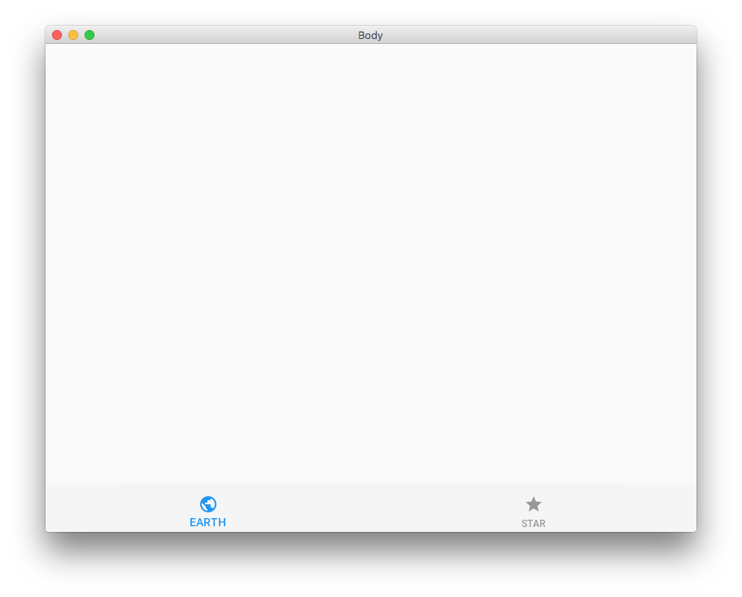

Slider

Switch Dot
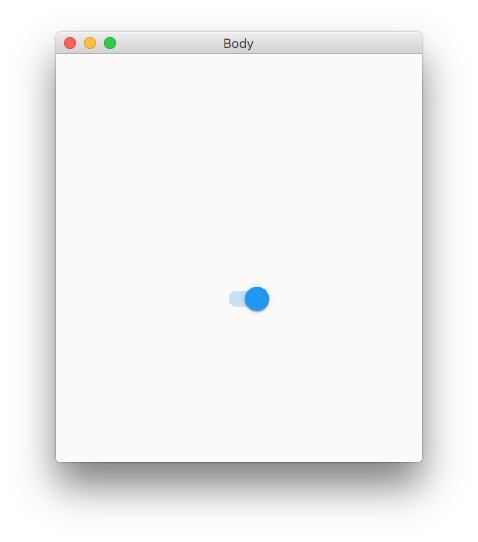

Checkbox
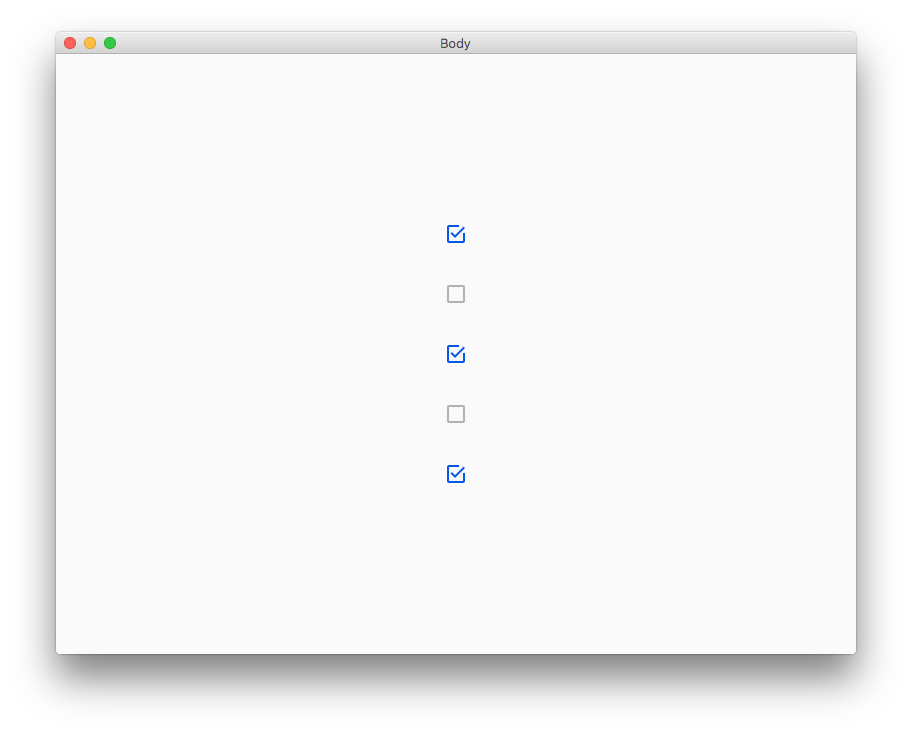

Chip
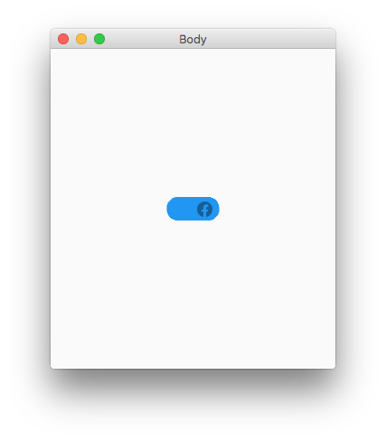

Card
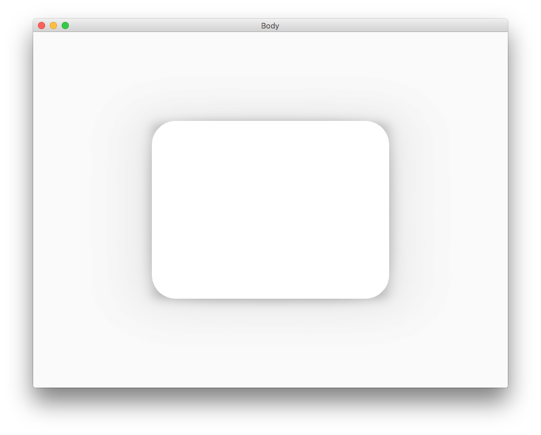

KivyMD Icons
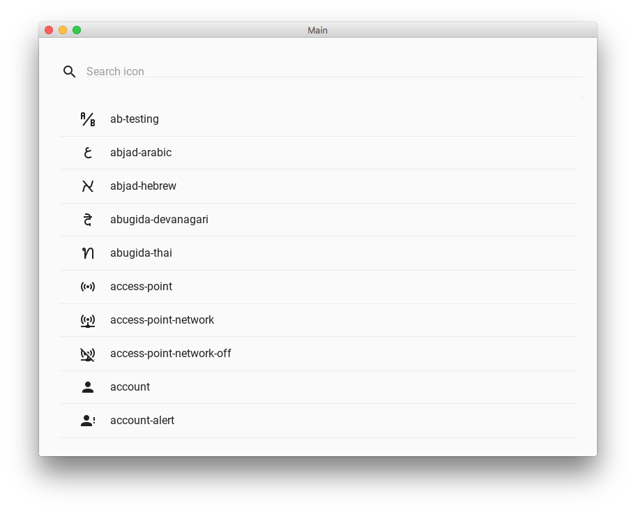